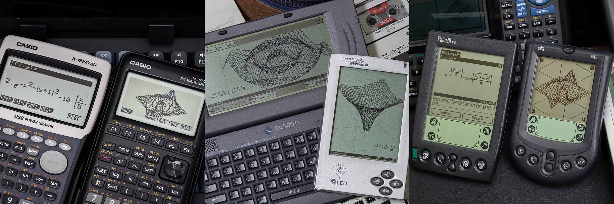

# Plotter-Z
A 3D function graph plotting tool designed for early handheld devices such as Windows CE 1.0 - 2.1, Palm OS 3, and CASIO fx-9860 series calculators.

This project is still in progress. Feedback and issues are welcome.

## Installation
### On Windows CE
Copy the `.exe` matching your CPU architecture to the device via Active Sync or external storage (CF, SD card) and run it.

> **Note:** For newer ARM-based devices (Windows CE 5.0, Windows Mobile), use `PlotterZ_hpc211_armdbg.exe`.

### On Palm OS
Install the `.prc` file via HotSync and run it.

## Supported Functions
The following mathematical functions can be used in expressions:

| Function | Description | Parameters |
|----------|-------------|------------|
| `sin(x)` | Sine | 1 |
| `cos(x)` | Cosine | 1 |
| `tan(x)` | Tangent | 1 |
| `asin(x)` | Arcsine | 1 |
| `acos(x)` | Arccosine | 1 |
| `atan(x)` | Arctangent | 1 |
| `sqr(x)` | Square root | 1 |
| `exp(x)` | Exponential (e^x) | 1 |
| `abs(x)` | Absolute value | 1 |
| `ln(x)` | Natural logarithm | 1 |

## Usage
### Windows CE
1. `File` > `Samples` to pick a preset sample expression.
2. `Edit` > `Expression` to enter your own expression.
3. `Edit` > `Window` to adjust the plot range (X/Y/Z bounds and grid resolution).
4. `View` to switch between interaction modes: camera rotation, pan move, zoom, and formula positioning.
5. `View` > `Reset` to restore the default camera angles and viewport.
6. `File` > `Save Session` / `Load Session` to persist or restore your current expression and window settings.

You can also toggle a footer status bar (`View` > `Toggle Footer`) showing the current camera angles, mode, and zoom level, and toggle the bounding box (`View` > `Toggle Boundary Box`).

### Palm OS
- **Main screen:**
  1. Enter an expression and tap `Parse`. If there are no errors the app renders the mathematical formula.
  2. `Options` > `Window Editor` to set the X/Y/Z plot ranges and grid resolution.
  3. `Options` > `Samples` to choose from preset sample expressions.
  4. Tap `Draw` to enter the 3D drawing view.

- **Drawing view:**
  1. The four corners of the screen are interactive buttons:
     - **Top-left** — return to the main screen.
     - **Top-right** — cycle through interaction modes (`C` = Camera rotate, `P` = Pan move, `Z` = Zoom).
     - **Bottom-left** — toggle the bounding box (`b`/`B`).
     - **Bottom-right** — reset camera angles, viewport, and zoom level.
  2. Drag on the canvas to interact (rotate / pan / zoom depending on the current mode).

### Troubleshooting on Windows CE
If the program fails with `FAILED: DIB SECTION`, some devices (tested on CASIO E-100 and iPAQ H3600) have trouble creating a 16-bit DIB section.

Create a file named `plotter-z.ini` in the root directory of your CE device with the following content to force 8 bpp mode:

```ini
[graphics]
force_bpp=8
```

## How It Works
The project is divided into several modules:

| Directory | Purpose |
|-----------|---------|
| `formula-z` | String expression parser |
| `evaluator-z` | Micro VM for numerical evaluation |
| `renderer-z` | AST to render tree conversion |
| `plotter-z` | Platform-specific app frontends |

### Formula-Z
This module takes a string input, checks for syntax errors, and converts the string into an AST (Abstract Syntax Tree).
Run tests with `make fz-test`:
```sh
./fz-test.exe -h "sin(sqr(x^2+y^2))"
```
Output:
```xml
<Function name="sin">
  <Parameter>
    <Function name="sqr">
      <Parameter>
        <Binary operator="ADD">
          <Binary operator="POW">
            <Variable> x </Variable>
            <Literal> 2 </Literal>
          </Binary>
          <Binary operator="POW">
            <Variable> y </Variable>
            <Literal> 2 </Literal>
          </Binary>
        </Binary>
      </Parameter>
    </Function>
  </Parameter>
</Function>
```

### Evaluator-Z
This module takes the AST generated by formula-z, checks for semantic errors, and compiles it into instructions for a micro virtual machine.
Run tests with `make ez-test`:
```sh
# -v declares variables x, y and sets them to 1 and 2
# -l lists compiled instructions
# -e specifies the expression
./ez-test.exe   \
    -v x 1      \
    -v y 2      \
    -l          \
    -e "sin(sqr(x^2+y^2))"
```
Output:
```
PUSH_VAR    0
PUSH_IMD    2
POW
PUSH_VAR    1
PUSH_IMD    2
POW
ADD
FUNC        sqr
FUNC        sin
Result = 0.786749
```

### Renderer-Z
This module takes the AST generated by formula-z and converts it into a render tree.
Run tests with `make rz-test`:
```sh
./rz-test.exe -h "sin(sqr(x^2+y^2))"
```
Output:
```xml
<Horizontal>
  <Text> sin </Text>
  <Enclosure>
    <Root>
      <Horizontal>
        <Superscript>
          <Body>
            <Text> x </Text>
          </Body>
          <Script>
            <Text> 2 </Text>
          </Script>
        </Superscript>
        <Text> + </Text>
        <Superscript>
          <Body>
            <Text> y </Text>
          </Body>
          <Script>
            <Text> 2 </Text>
          </Script>
        </Superscript>
      </Horizontal>
    </Root>
  </Enclosure>
</Horizontal>
```

## Plotter-Z
This module contains platform-specific implementations of the plotter-z app.

| Directory | Purpose |
|-----------|---------|
| `sdl` | Proof-of-concept app using SDL |
| `win32-classic` | Test only, deprecated |
| `win32-native` | Win32 API app for Windows CE / Desktop |
| `palm` | Palm OS version |
| `fx` | CASIO fx-9860 version |

## License
This project is licensed under the MIT License.
